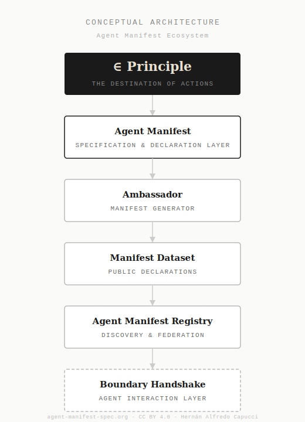

# Agent Manifest Ecosystem Map

This document describes the structure of the Agent Manifest ecosystem and the role of each repository.

The system is organized as a minimal infrastructure for declarative AI agent identity.

-----

## Ecosystem Architecture



-----
## System Overview

The Agent Manifest system follows this operational flow:

```
Manifest Specification
↓
Manifest Generation
↓
Submission
↓
Validation Pipeline
↓
Dataset Storage
↓
Registry Index
↓
Discovery Endpoint
```

-----

## Ecosystem Architecture

The Agent Manifest ecosystem consists of six repositories.

-----

## 1. agent-manifest

Repository: <https://github.com/agent-manifest/agent-manifest>

Role: The canonical specification of the Agent Manifest standard.

Contains:

- specification
- JSON schema
- terminology
- architecture documentation
- examples
- operational documentation

This repository defines the structure of a valid Agent Manifest.

-----

## 2. agent-manifest-ambassador

Repository: <https://github.com/agent-manifest/agent-manifest-ambassador>

Role: Manifest generator.

Ambassador assists users in creating valid Agent Manifest declarations and prepares submissions to the dataset repository.

Capabilities:

- generate manifest JSON
- assist declaration
- prepare GitHub submission

-----

## 3. agent-manifest-diplomat

Repository: <https://github.com/agent-manifest/agent-manifest-diplomat>

Role: Registration gateway.

The Diplomat is the operational API layer between manifest submissions and the dataset repository.

It receives manifest submissions, verifies structural conformance, and writes valid declarations to the dataset.

The Diplomat does not enforce policy, score risk, or determine compliance. It validates structure and records declarations.

-----

## 4. agent-manifest-dataset

Repository: <https://github.com/agent-manifest/agent-manifest-dataset>

Role: Operational dataset and registration pipeline.

Functions:

- receives manifest submissions
- validates manifest structure
- stores manifests
- maintains the public dataset

Manifests are stored using the following structure:

```
manifests/YYYY/MM/agent-name.json
```

-----

## 5. agent-manifest-registry

Repository: <https://github.com/agent-manifest/agent-manifest-registry>

Role: Registry definition and discovery layer.

The registry provides a machine-readable index of registered agents.

The public discovery endpoint is:

```
https://agent-manifest-spec.org/.well-known/agent-manifest-registry.json
```

-----

## 6. boundary-handshake

Repository: <https://github.com/agent-manifest/boundary-handshake>

Role: Conceptual extension exploring compatibility verification between agents prior to interaction.

This repository is experimental and not part of the current operational pipeline.

-----

## Operational Pipeline

The current operational pipeline is:

```
Ambassador
↓
GitHub Issue submission
↓
Diplomat (registration gateway)
↓
Dataset workflow
↓
Manifest validation
↓
Dataset storage
↓
Registry update
↓
Discovery endpoint
```

-----

## Operational Components

Operational today:

- agent-manifest
- agent-manifest-ambassador
- agent-manifest-diplomat
- agent-manifest-dataset
- agent-manifest-registry

Conceptual / research:

- boundary-handshake

-----

## Purpose of the Ecosystem

The ecosystem provides minimal infrastructure for:

- declarative AI agent identity
- transparent agent declarations
- auditable registration
- discoverable agent manifests

The system follows the principle:

**Declare before interacting.**
